# Integración de Sistemas Heterogéneos

## Infraestructura base

### Windows Server

Para este caso he utilizado Windows Server 2025 con un adaptador host only, sin nada fuera de lo común durante la instalación del SO.

Una vez instalado y actualizado (para evitar posibles problemas), he cambiado el nombre del equipo desde el apartado Servidor local > Nombre de equipo, se nos abrirá una ventana de Propiedades del sistema y seleccionamos cambiar. Se nos abre una nueva ventana en la que pondremos el nombre deseado en el equipo. 

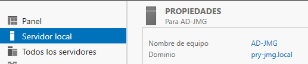

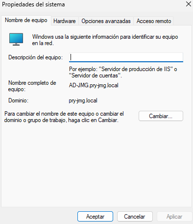

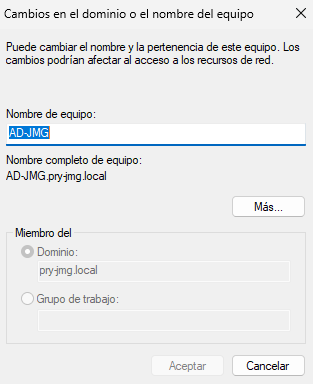

Establecemos una IP estática para que esta máquina la cual va a ser el controlador de dominio no cambie, lo cual daría problemas. Para ello nos vamos a `Panel de control > Redes e Internet > Centro de redes y recursos compartidos` y seleccionamos nuestro adaptador, se nos abre una ventana en la que seleccionamos `Propiedades`, en la nueva ventana seleccionamos `Protocolo de Internet version 4 (TCP/IPv4)` y por último escribimos la IP que vamos a utilizar y añadimos la IP localhost como DNS preferido

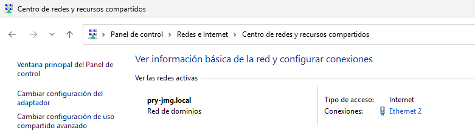

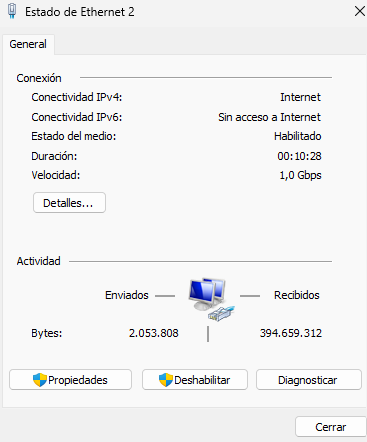

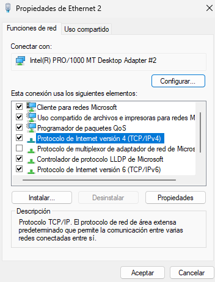

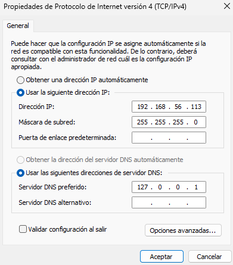

Una vez hecho estos primeros pasos reiniciamos para que se apliquen.

Ahora vamos a instalar el servicio de Active Directory, seleccionamos `Administrar > Agregar roles y características`. Se nos abrirá una ventana en la que dejamos todo por defecto hasta llegar a `Roles de servidor` donde deberemos marcar el checkbox que dice `Servicios de dominio de Active Directory`. Esperamos a que se instale y reiniciamos la máquina para que se aplique.

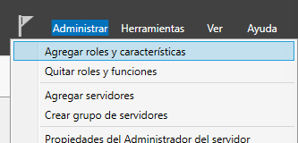

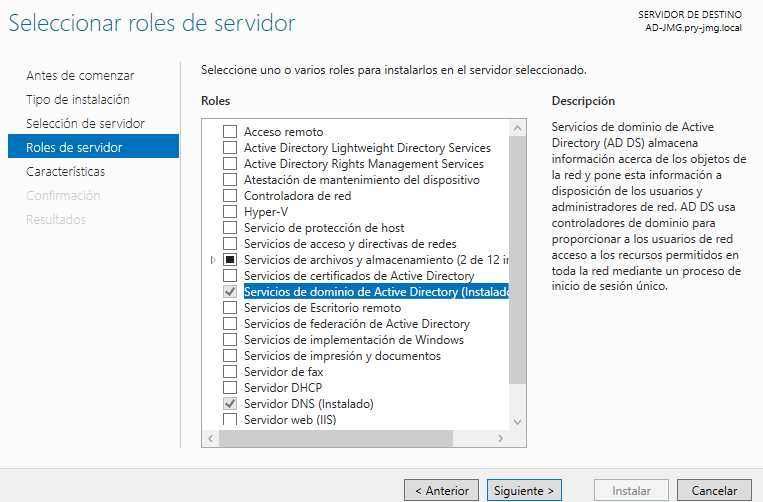

Ahora veremos un aviso en la parte superior derecha del Administrador del servidor, al seleccionarla nos indica que debemos `Promover este servidor a controlador de dominio`. Se nos abrirá una ventana en la que seleccionamos `Agregar un nuevo bosque` y le damos un nombre. Todo lo demás lo dejamos por debecto y finalizamos. Tardará un poco pero ya tendríamos nuestro Active Directory instalado.

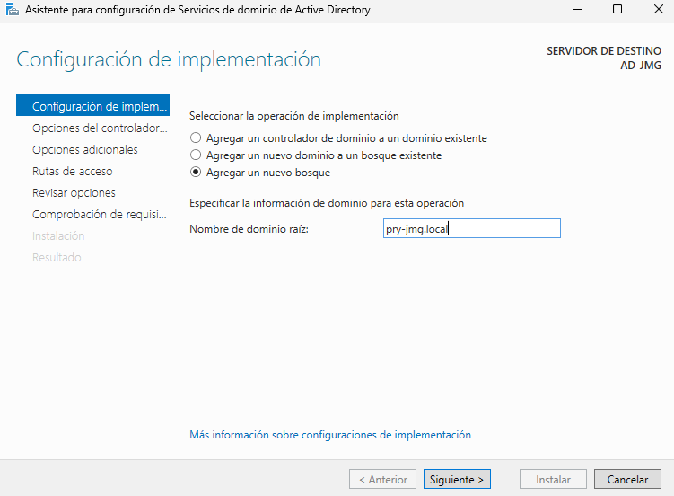

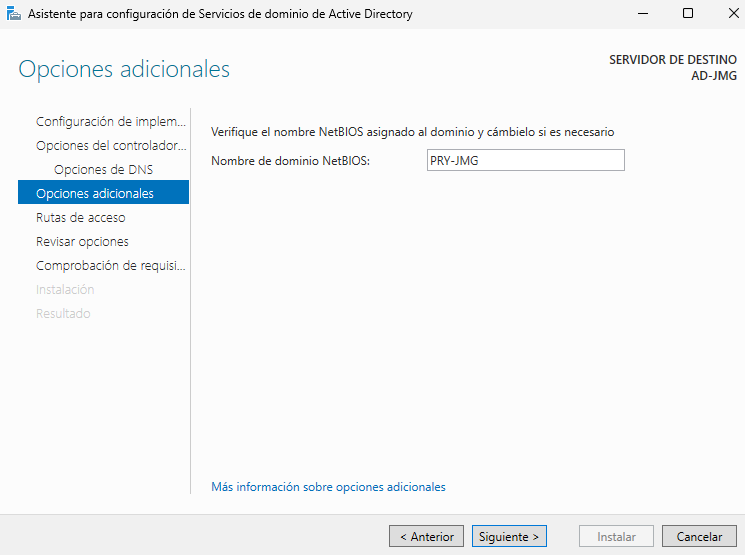

Ahora vamos a crear la estructura básica solicitada, para ello nos vamos `Herramientas > Usuarios y equipos de Active Directory` donde creamos 3 Unidades organizativas para Ventas, IT y Gerencia haciendo click derecho sobre el `bosque > Nuevo > Unidad organizativa`, se nos abrirá una ventana en la que solo tendremos que introducir el nombre. A mayores he añadido un grupo a cada una de ellas con 2 usuarios. Para crearlos hacemos click derecho sobre el espacio en blanco dentro de cada Unidad organizativa y seleccionamos `Nuevo > Grupo/Usuario` se abrirá una ventana en ambos casos donde rellenaremos los datos y aceptaremos.

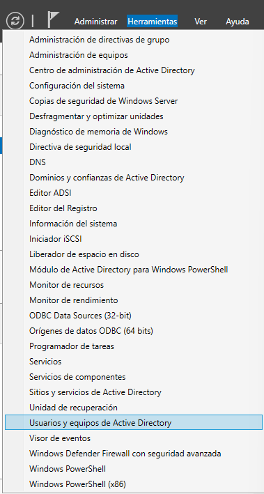

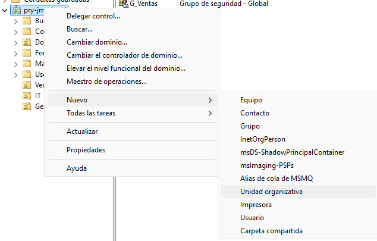

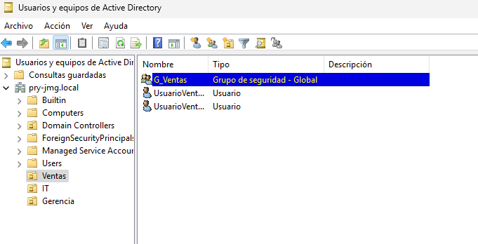

### Ubuntu Server

El Ubuntu Server que voy a utilizar es Ubuntu Server 20.04 LTS, al igual que en Windows Server he utilizado un adaptador de red Host only y he seguido los pasos de la instalación de la manera habitual.

Una vez instalado he configurado la red editando el fichero `/etc/netplan/00-installer-config.yaml`, para aplicar la configuración hago un `sudo netplan apply`.

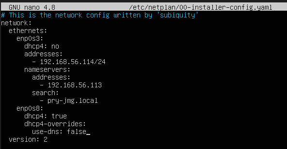

## Metodo Clasico

Para este metodo vamos a utilizar Samba más Winbind para conectar Ubuntu Server con Active Directory. Para ello primero hacemos un `sudo apt upgrade -y` y un `sudo apt update`.

Con esto hecho vamos a instalar las herramientas y dependencias que vamos a necesitar con el siguiente comando:

`sudo apt install samba krb5-config krb5-user winbind libnss-winbind libpam-winbind -y`

Durante la instalación de `krb5-config` se nos pedirá el `Default Kerberos Realm`, en mi caso es `PRY-JMG.LOCAL`.

***MUY IMPORTANTE PONERLO CON MAYUSCULAS*** 

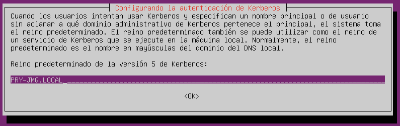

Una vez hemos instalado todo podemos pasar a configurar, empezando por `/etc/krb5.conf`

En el primer apartado `[libdefaults]`añadimos esto:

```
default_realm = PRY-JMG.LOCAL
dns_lookup_realm = false
dns_lookup_kdc = true
```

En el apartado `[realms]` añadimos esto (Con la ip de Active Directory correspondiente de cada uno):

```
PRY-JMG.LOCAL = {
    kdc = 192.168.56.113
    admin_server = 192.168.56.113
}
```

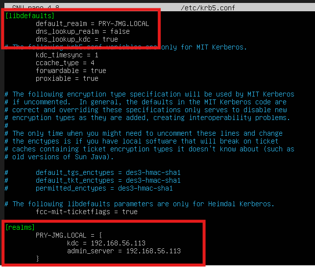

Ahora configuraremos Samba, para ello editamos el archivo `/etc/samba/smb.conf`

En el apartado `[global]` añadimos las siguientes lineas:

```
[global]
   workgroup = PRY-JMG
   security = ADS
   realm = PRY-JMG.LOCAL

   # Configuración de Winbind para mapeo de IDs
   idmap config * : backend = tdb
   idmap config * : range = 3000-7999
   idmap config PRY-JMG : backend = rid
   idmap config PRY-JMG : range = 10000-999999

   template shell = /bin/bash
   template homedir = /home/%U

   winbind use default domain = true
   winbind offline logon = false
```


El siguiente archivo a editar es `/etc/nsswitch.conf` en el que deberemos editar el apartado passwd y group:

```
passwd:     files winbind
group:      files winbind
```

Con todo configurado podemos conectarnos a nuestro Active Directory con la linea `sudo net ads join -U Administrador`, nos solicitará una contraseña, la cual es la que hemos establecido al instalar Active Directory.

Por último reiniciamos los servicios winbind smbd y nmbd con `sudo systemctl restart winbind smbd nmbd`

Ahora ya estaría listo para hacer las comprobaciones y pruebas

- Listar usuarios con `wbinfo -u`

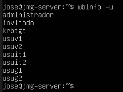

- Listar grupos con `wbinfo -g`

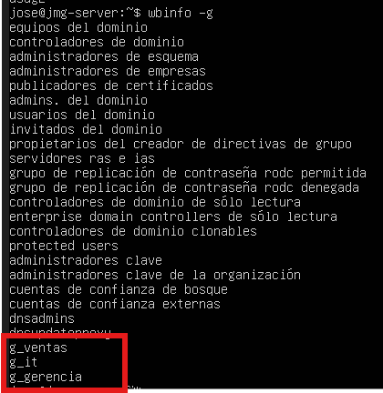

### Carpeta compartida

Creamos la carpeta solicitada con `sudo mkdir -p /srv/samba/ventas`

Le cambiamos el propietario con `sudo chgrp "PRY-JMG\G_Ventas" /srv/samba/ventas`

Y le damos permisos totales de lectura/escritura al grupo con `sudo chmod 770 /srv/samba/ventas`

Con la carpeta lista ahora vamos a "compartirla" en la red que hemos creado, para ello volvemos a editar el archivo `/etc/samba/smb.conf` en el que creamos un apartado para la carpeta que estamos compartiendo.

```
[ventas]
   comment = Carpeta de Ventas - Acceso AD
   path = /srv/samba/ventas
   browseable = yes
   read only = no
   guest ok = no
   valid users = "@PRY-JMG\G_Ventas"
   force group = "PRY-JMG\G_Ventas"
   directory mask = 0770
   create mask = 0770
```

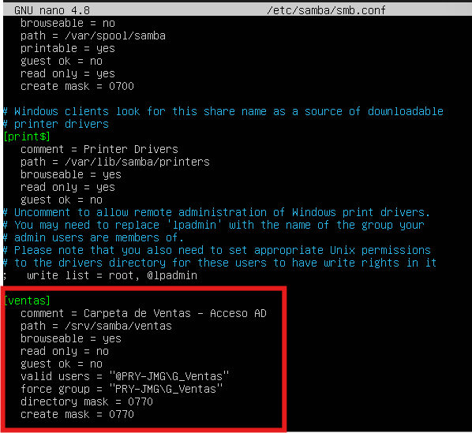

Por último, reiniciamos los servicios de nuevo con `sudo systemctl restart winbind smbd nmbd`

Para comprobarlo nos vamos a Windows Server y nos conectamos a la carpeta ventas desde el explorador de archivos con `\\192.168.56.114\ventas`

Se nos abrira una ventana en la que tendremos que meter el usuario y contraseña de uno de los usuarios de del grupo ventas.

Si intentamos entrar con un usuario que no pertenezca a ventas nos denegará el acceso.

Creamos un txt para comprobar que lo podemos encontrar en Ubuntu con `sudo ls -l /srv/samba/ventas`.

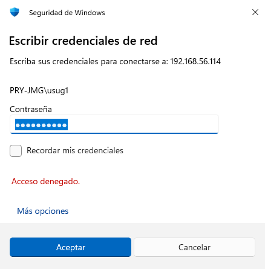


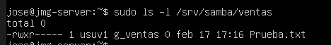

## Metodo Moderno

