# PR0501 Creación de dominio

## Instalación de Active Directory

Necesitaremos una máquina con 2 adaptadores de red, un adaptador solo anfitrión y un adaptador NAT

Para instalar Active Directory debemos asignar primero una ip estática al adaptador solo anfitrión, lo configuramos para que tenga como dns la propia máquina (localhost 127.0.0.1) y asignarle un nombre al equipo.

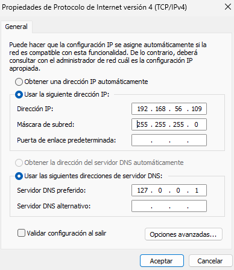

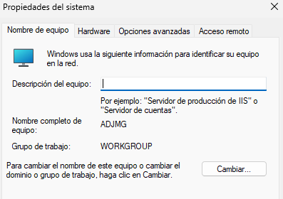

Para instalar Active Directory seleccionamos Administrar > Agregar roles y características y seleccionamos el rol de "Servicios de dominio de Active Directory".

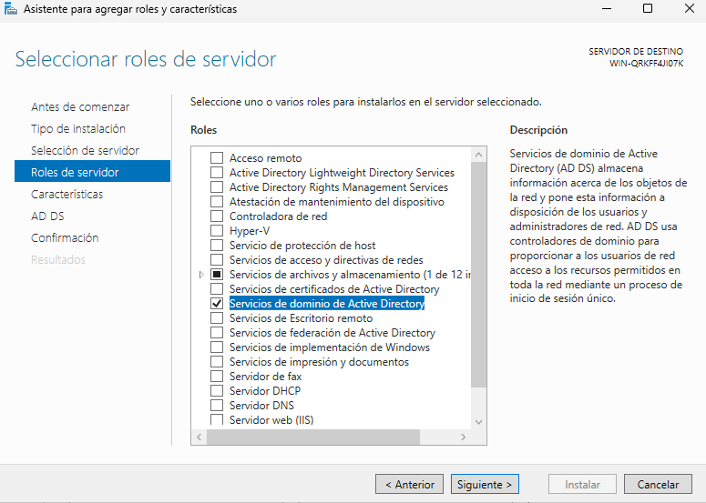

## Tarea 1: Promoción del controlador de dominio

Una vez instalado nos saldrá un aviso en el icono con forma de bandera, debemos pinchar en el y luego en "Promover este servidor a controlador de dominio".

Se abrirá una ventana para configurar Active Directory:

- Seleccionamos "Agregar un nuevo bosque" y en nombre de dominio raíz ponemos *nombre*.local
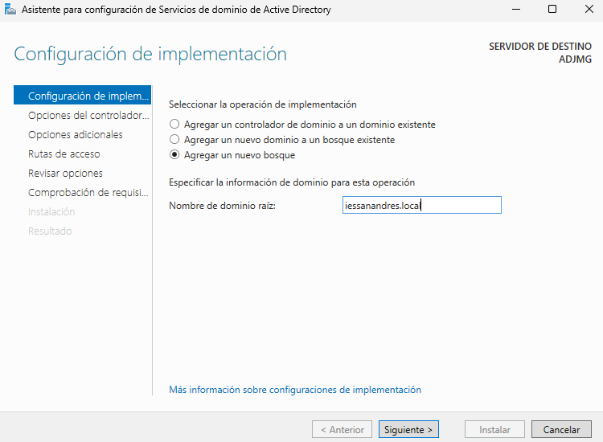
- En "Opciones de controlador de dominio" no modificamos nada, solo añadimos una contraseña.
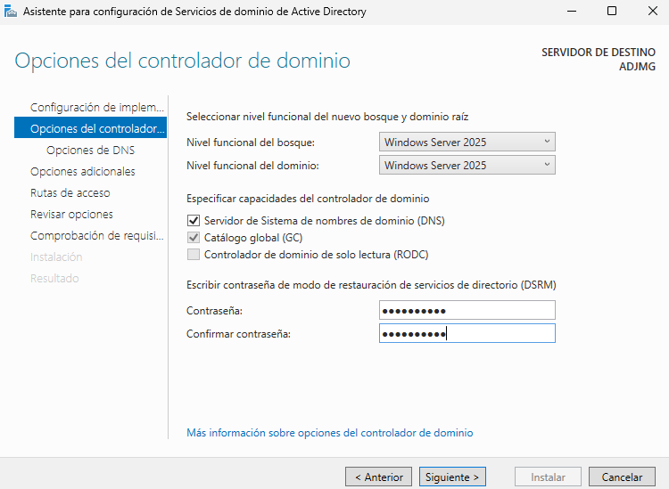
- En "opciones adicionales" añadiremos un nombre NetBIOS, por defecto pone el que hemos utilizado para crear el bosque.
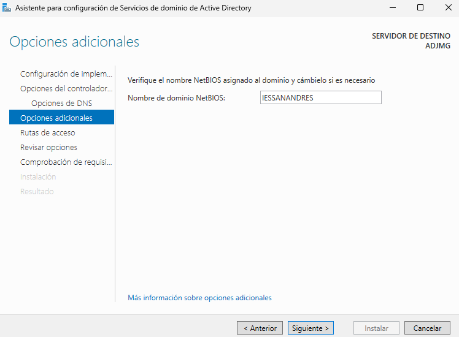
- Vamos hasta el final sin modificar nada más y hacemos click en instalar.

Una vez instalado se reiniciará la máquina.

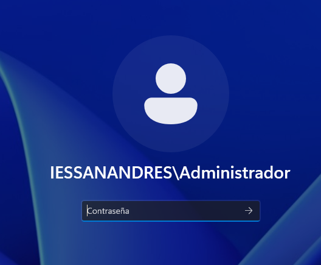

## Tarea 2: Diseño de la estructura de Unidades Organizativas

Desde el administrador del servidor > Herramientas, hacemos click en "Centro de administración de Active Directory" que nos abrirá una ventana similar al administrador del servidor pero para Active Directory.

En el menu izquierdo seleccionamos "iessanandres (local)" (el bosque que hemos creado), veremos muchas carpetas, la que nos interesa es "Users", la seleccionamos y luego en el panel derecho seleccionamos "Nuevo", desde ahi podremos crear grupos y usuarios.

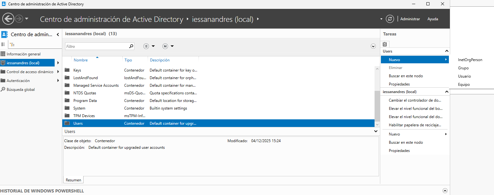

- IES San Andres (UO Raíz para la gestión del      centro)
  - Alumnado
    - Informatica
      - DAM
      - DAW
      - ASIR
      - SMR
      - IAyBD
    - Administracion
      - AFI
      - GAD
      - SCO . Profesorado
  - Personal_PAS (Personal de Administración y Servicios)
  - _Grupos (UO para almacenar todos los grupos de seguridad)
  - _Equipos (UO para los equipos del dominio)
    - Aulas_Informatica
    - Aulas_Administracion
    - Despachos

Para crear esta estructura, desde el administrador del servidor seleccionamos Herramientas > Usuarios y equipos de Active Directory.

Desde la nueva ventana que se nos abre hacemos click derecho sobre iessanandres.local > Nuevo > Unidad organizativa y crearemos la estructura antes planteada.

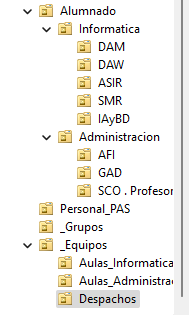

## Tarea 3: Creación de Usuarios y Grupos

### Usuarios

Para crear los usuarios en su Unidad Organizativa correspondiente, hacemos click derecho en la Unidad Organizativa que nos interese > Nuevo > Usuario, esto nos abrirá una ventana de creación de usuario donde introduciremos nombre y nombre de inicio de sesión, hacemos click en siguiente y ahora nos pedirá asignarle una contraseña.

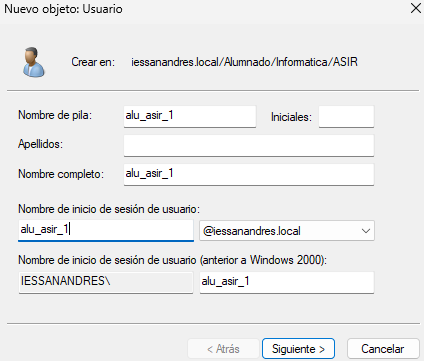

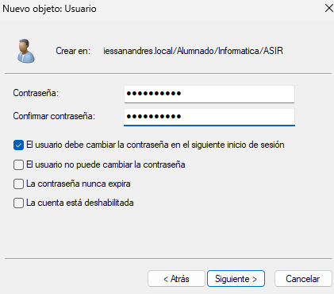

Esto se repetirá para tantos usuarios necesitemos.

### Grupos

Hacemos click derecho sobre la Unidad Organizativa llamada _Grupos > Nuevo > Grupo, se nos abrirá una ventana para crear el grupo, en la cual escribimos el nombre del grupo, seleccionamos el ámbito del grupo y el tipo de grupo.

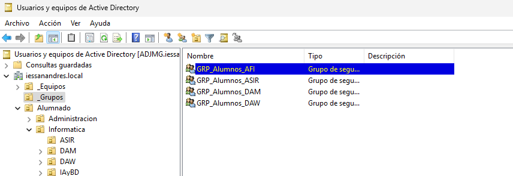

Esto se repetirá tantas veces como grupos haya.

### Asignar miembros

Para asignar miembros a los grupos se puede hacer de 2 modos, indicando el grupo al que pertenece cada usuario desde las propiedades del usuario > Miembro de, o bien añadiendo los usuarios desde las propiedades del grupo > Miembros.

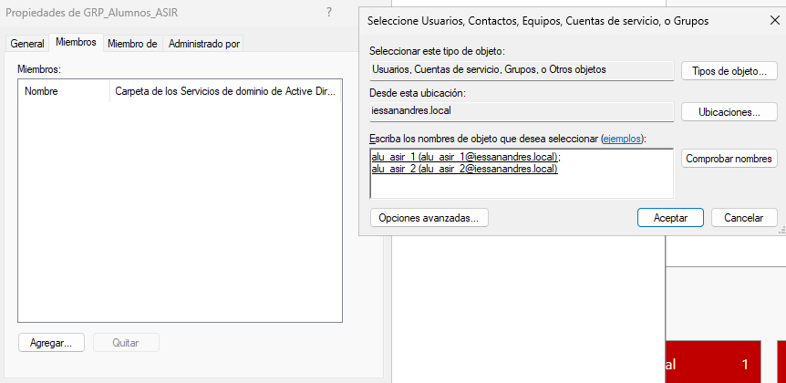

## Tarea 4: Restricción de Horas de Inicio de Sesión

Para asignar horarios podemos hacerlo de usuario en usuario, o bien seleccionar varios a la vez, de igual modo tras seleccionar lo que necesitemos hacemos click derecho > propiedades > cuenta y activamos y seleccionamos "Horas de sesión".

Los horarios se marcan creando una cuadricula de cuadros azules.

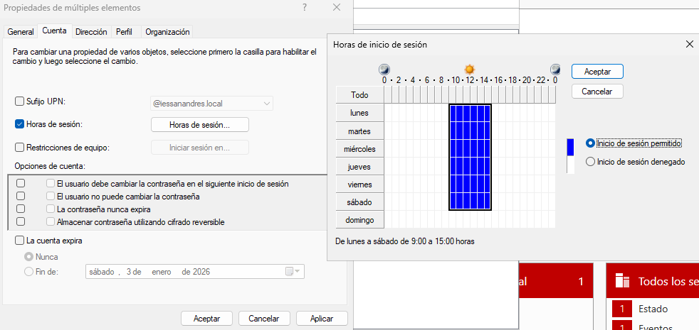