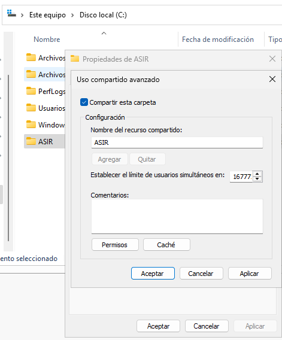
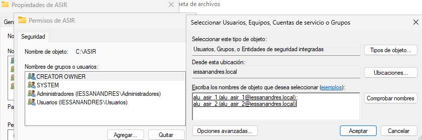
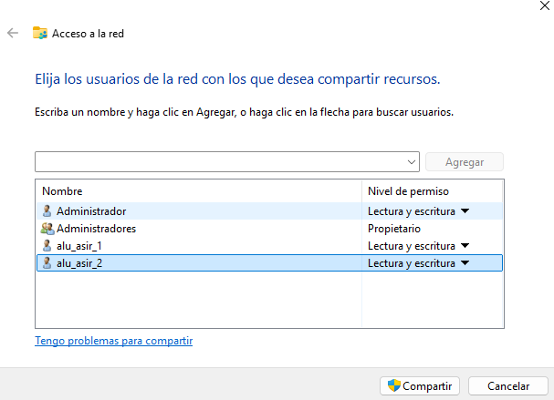
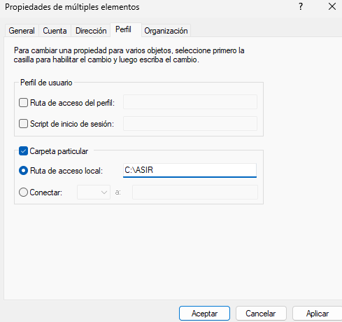
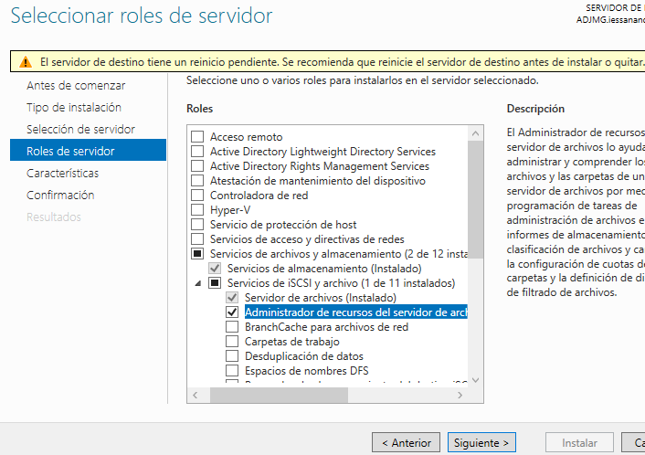
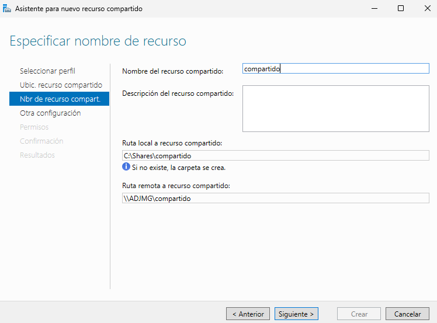
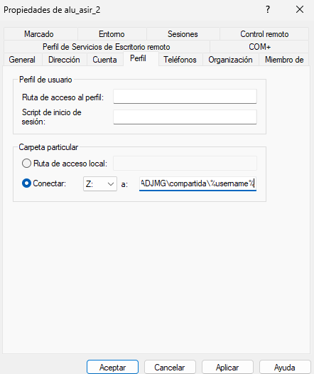
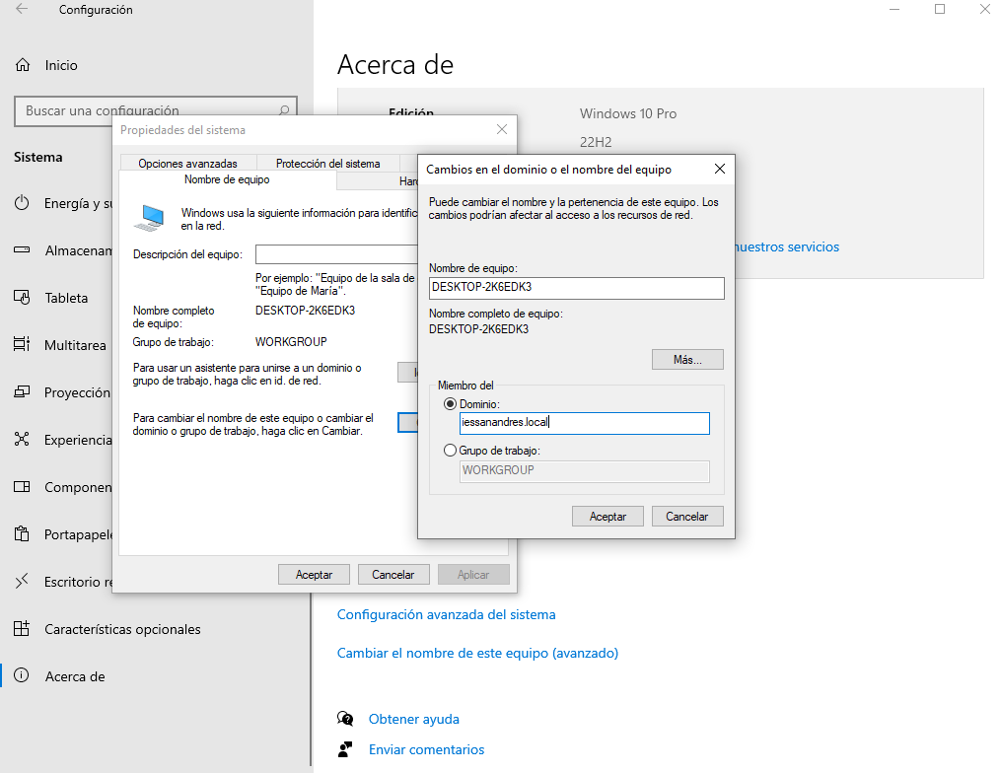
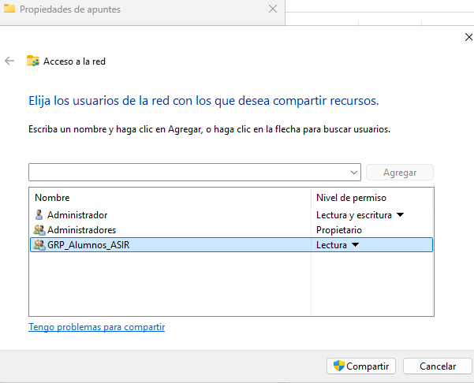
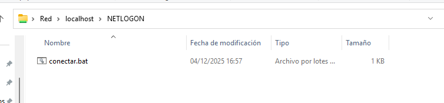

# PR0502: Carpetas personales y compartidas por un grupo

## Creación de usuarios y grupos

En C:\ Creamos una carpeta llamada ASIR la cual vamos a compartir con los alumnos de ASIR.

Hacemos click derecho sobre la carpeta y seleccionamos Propiedades > Compartir > Uso compartido avanzado...

Esto abrirá una ventana en la cual marcamos el checkbox de "Compartir esta carpeta" y aceptamos.

Ahora desde las propiedades de la carpeta seleccionamos la pestaña Seguridad > Editar para agregar los usuarios de ASIR.

Sin salir de propiedades > compartir seleccionamos "Compartir", esto abrirá una ventana en la que veremos todos los usuarios y grupos con los que vamos a compartir la carpeta y pulsamos compartir.

Desde Administrador del servidor > Herramientas > Usuarios y grupos de Active Directory, seleccionamos a los usuarios de ASIR y vamos a sus propiedades, desde propiedades > Perfil marcamos el checkbox de "Carpeta particular" y en Ruta de acceso local escribimos la ruta de la carpeta ASIR.

## Carpetas personales

Vamos a Administrar > Añadir roles y caracteristicas, seleccionamos el rol "Administrador de recursos del servidor de archivos y lo instalamos.

Ahora en el administrador de servidor, en el panel izquierdo tendremos el apartado de Servicios de archivos y de almacenamiento, el cual seleccionamos.

Se nos abrirá otro menú, en el cual seleccionamos Recursos compartidos, ahora en la zona en blanco del centro hacemos click derecho > Nuevo recurso compartido...

Se nos abre una ventana para crear un nuevo recurso compartido, dejamos todo por defecto menos el nombre, que le ponemos compartido (Por defecto utilizará la carpeta C:\shares), pulsamos Crear.

Para crear una carpeta para cada usuario en vez de crarla manualmente haremos lo siguiente:

Vamos a Usuarios y equipos de Active Diretory y buscamos uno de los usuarios que hayamos creado, hacemos clic derecho > Propiedades > Perfil, ahí cambiaremos el botón de radio de Carpeta particular a Conectar, e introduciremos la ruta absoluta de la carpeta.

### Comprobación

Desde un Windows 10 con un adaptador solo anfitrión, comprobamos que tiene una ip de la misma red que nuestro servidor, podemos comprobarlo con un ping.

Para conectarlo al dominio que hemos creado vamos a Configuración > Sistema > Acerca de, seleccionamos la opción de "Configuración avanzada del sistema" en el menú derecho, seleccionamos la pestaña Nombre de equipo y pulsamos cambiar..., en el apartado Miembro de, añadimos nuestro dominio (iessanandres.local).

Se reiniciará el equipo, al iniciarse ya podremos entrar como los usuarios de ASIR, con ellos ya tendremos acceso a la carpeta compartida.

## Carpetas compartidas por un grupo

En C:\shares creamos la carpeta apuntes, desde sus propiedades > Compartir pulsamos compartir y añadimos el grupo ASIR.

Para que se monte automaticamente necesitaremos un .bat que crearemos en localhost\NETLOGON (Usamos el buscador poniendo \\localhost\NETLOGON).

El contenido del .bat es el siguiente:

`net use I: \\ADJMG\compartida\apuntes`

Desde Usuarios y equipos de Active Directory accedemos a las propiedades de los usuarios de ASIR > Perfil, marcamos el checkbox de Script de inicio de sesión: y escribimos en nombre del .bat que hemos creado.

Ahora al reiniciar deberá aparecer ya montada la carpeta apuntes.

Ahora repetimos todo el proceso pero para la carpeta practicas, con una diferencia importante, en el archivo .bat deberemos cambiar la letra para que no cree conflicto ni con la I no con la H de antes:

`net use J: \\ADJMG\compartida\practica`