# PR0503: Aplicación de GPOs y Seguridad

## PARTE I: Configuración de políticas de usuario

### Tarea 1.1: Creación del GPO “Restricciones Alumnos”

Accedemos a "Administración de directivas de grupo" desde Administrador del servidor > Herramientas, ahí buscaremos la unidad organizativa Alumnado, le daremos click derecho y hacemos click en "Crear un GPO en este dominio y vincularlo aquí. Le asignamos de nombre GPO_ALU_RESTRICCIONES.

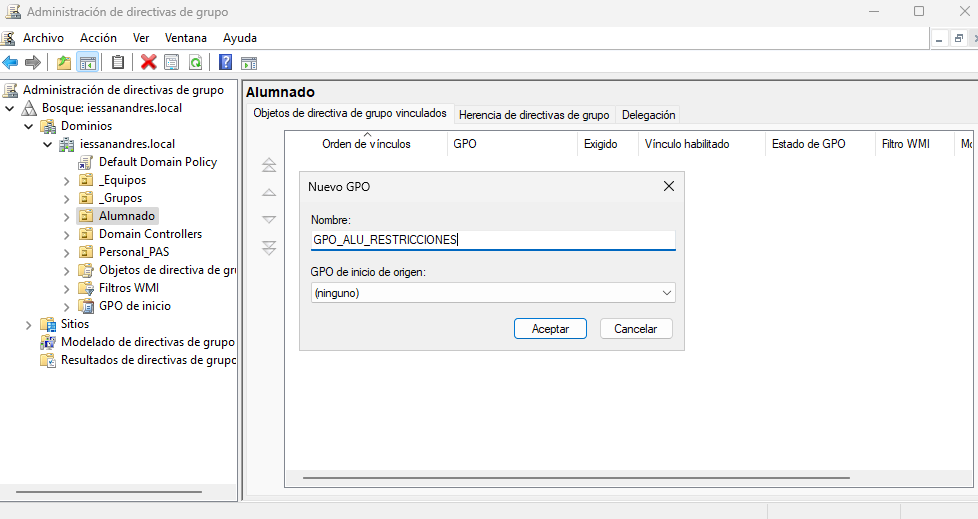

Haciendo click derecho > Editar se nos abrirá una ventana donde tendremos directivas.

Vamos a Configuración de usuario > Directivas > Plantillas administrativas > Panel de control y habilitamos la política "Prohibir el acceso a Configuración de PC y a Panel de control".

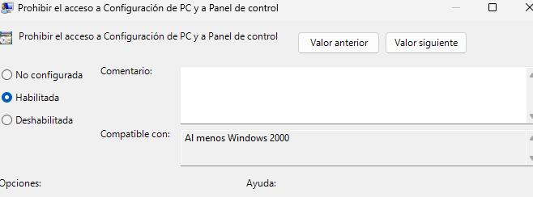

Creamos una carpeta con una imagen para que todos tengan acceso y creamos el recurso compartido desde Administrador de servidor haciendo click derecho > Nuevo recurso compartido y seguimos los pasos.

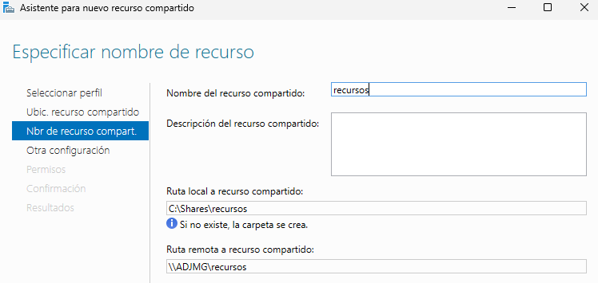

Ahora, para configurar la nueva restricción vamos a la carpeta donde estabamos antes al apartado Plantillas administrativas > Active Desktop > Active Desktop y habilitamos Active Desktop y Tapíz de escritorio, en el cual ponemos la ruta del recurso compartido.

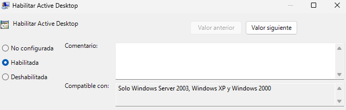

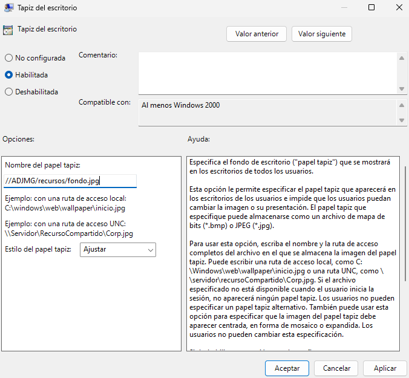

Para la última restricción vamos a Plantillas administrativas > Componentes de windows > Explorador de archivos y habilitamos la directiva "Ocultar estas unidades especificadas en MiPC" y selecciono la opción "Restringir solo las unidades A, B, C, y D.

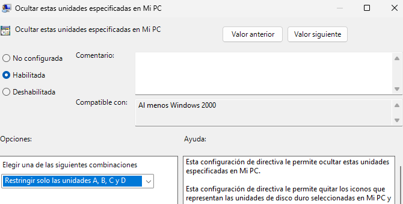

### Tarea 1.2: Verificación de usuario

Para comprobar el correcto funcionamiento de las restricciones iniciamos sesión con un usuario que esté en Alumnos.

Para forzar a que se realicen las actualizaciones que hemos hecho, desde la terminal ejecutamos `gpupdate /force`.

## PARTE II: Políticas de equipo y acceso a recursos

### Tarea 2.1: Política de seguridad (UO Equipos)

Creamos un nuevo GPO llamado GPO_SEG_BASE.

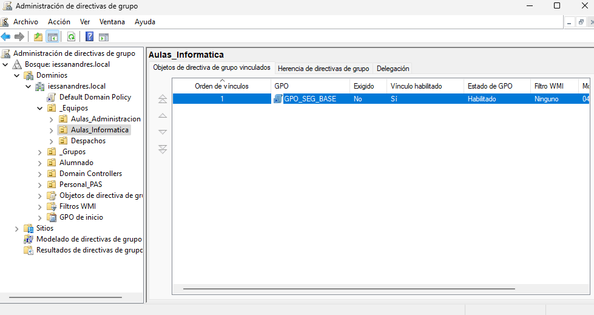

En la directiva de seguridad "Longitud minima de la contraseña" situada en Directivas > Configuración de windows > Configuración de seguridad > Directivas de cuenta, establecemos una longitud de 8 caracteres.

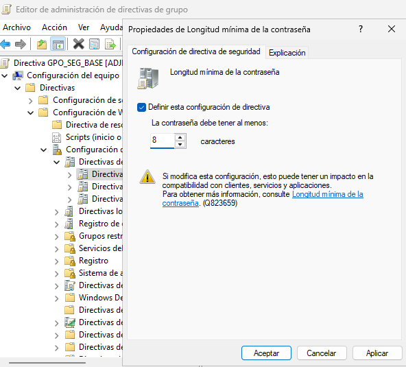

Si en lugar de Directivas de cuenta entramos a Directivas locales > Opciones de seguridad, podremos editar la directiva "Cuentas: cambiar el nombre de la cuenta de administrador", le ponemos AdministradorLocal1.

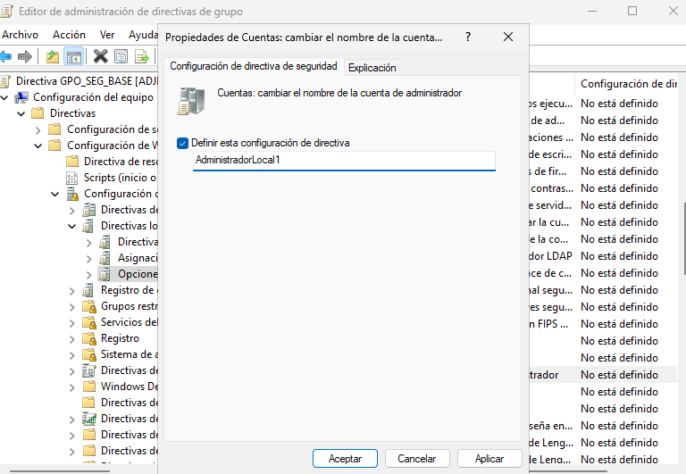

### Tarea 2.2: Mapeo de unidad específica (UO Administración)

Creamos una GPO llamada GPO_ADM_UNIDAD_Z vinculada a la unidad organizativa Alumnado.

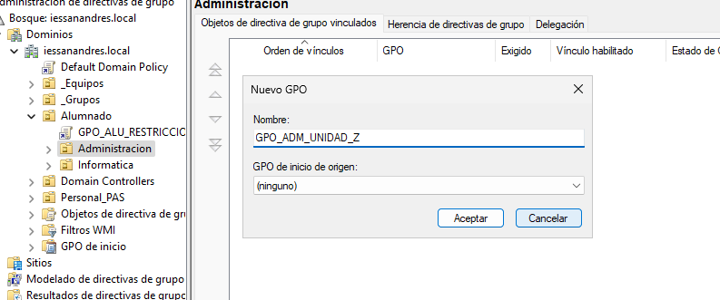

En Configuración de usuario > Preferencias > Asignaciones de unidades hacemos click derecho en el espacio en blanco y luego Nuevo > Unidad asignada, le indicamos que utilice la Z y le ponemos de nombre Recursos_ADM en el apartado etiqueta.

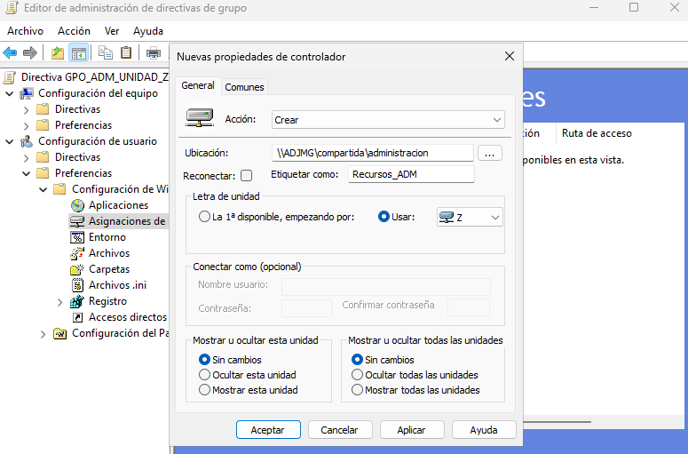

### Tarea 2.3: Verificación de Recurso

Por último verificaremos el correcto funcionamiento desde los usuarios alumnos desde windows 10, para ello iniciamos sesión con esos usuarios.

Desde los usuarios de asir no aparece el volumen Z, pero desde los usuarios de afi si.