# PR0504: Directivas de seguridad, GPP y Filtros WMI

## Parte 1: Endurecimiento de la seguridad

### 1.1. Protección de cuentas y acceso

Desde el administrador del servidor nos vamos a Herramientas > Administrador de directivas de grupo, vinculado a Equipos crearemos una GPO llamada GPO_Harden_Security_Equipos.

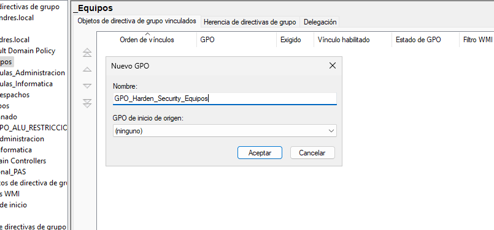

Para asignarle directivas hacemos click derecho sobre la GPO > Editar.

Dentro de Directivas > Configuración de windows > Configuración de seguridad > Directivas locales > Opciones de seguridad localizamos la directiva "Cuentas: cambiar el nombre de la cuenta de administrador" y le ponemos "Admin_Local_IES".

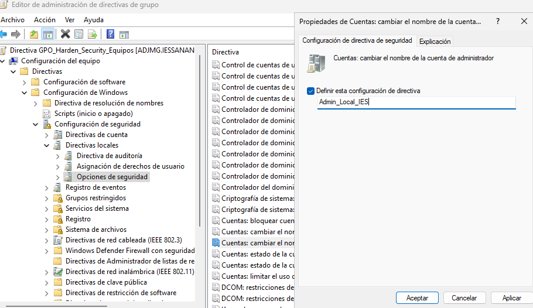

En el mismo apartado también está la directiva "Inicio de sesión interactivo: no requerir Ctrl+Alt+Supr" y marcamos deshabilitado.

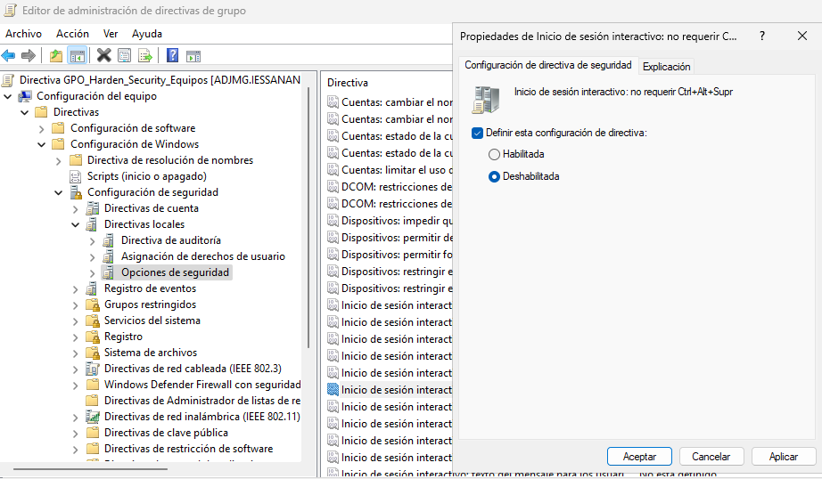

### 1.2. Aviso legal (Consentimiento Informado)

En este apartado modificamos la directiva "Inicio de sesión interactivo: título del mensaje para los usuarios que intentan iniciar una sesión" y ponesmos "Aviso de Seguridad del IES San Andrés"

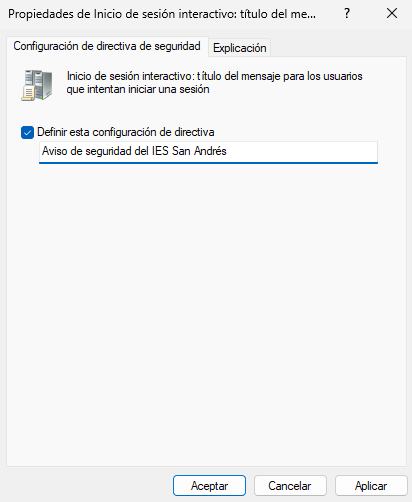

También editamos la directiva "Inicio de sesión interactivo: texto del mensaje para los usuarios que intentan iniciar una sesión" y ponemos "El uso de este equipo está monitorizado. El acceso está restringido únicamente a personal y alumnado autorizado."

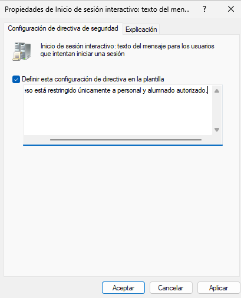

### 1.3. Privacidad y apagado

En este apartado vamos a la directiva "Inicio de sesión interactivo: No mostrasr último inicio de sesión" y la habilitamos.

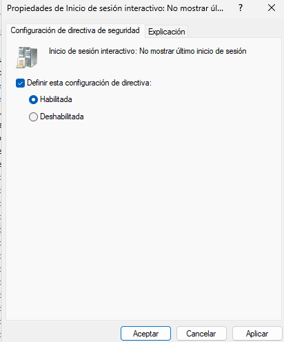

También deshabilitamos la directiva "Apagado: permitir apagar el sistema sin tener que iniciar sesión"

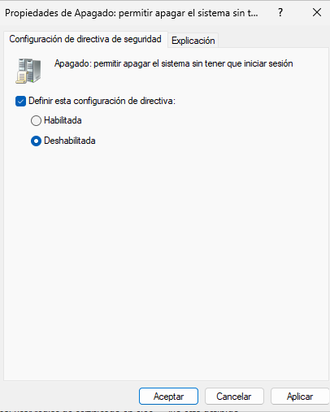

## Parte 2: Preferencias de Grupo (GPP) y segmentación

Creamos una GPO vinculada a la raiz del dominio llamada GPO_Configuración_Usuario_Dinamica".

### 2.1. Mapeo de unidades de red (Drive Maps)

En C:\Shares creamos una carpeta llamada "recursos_profesores" y desde Propiedades > Compartir > Configuración avanzada y añadimos el grupo GRP_Profesores_General, le daremos todos los permisos y quitaremos al resto.

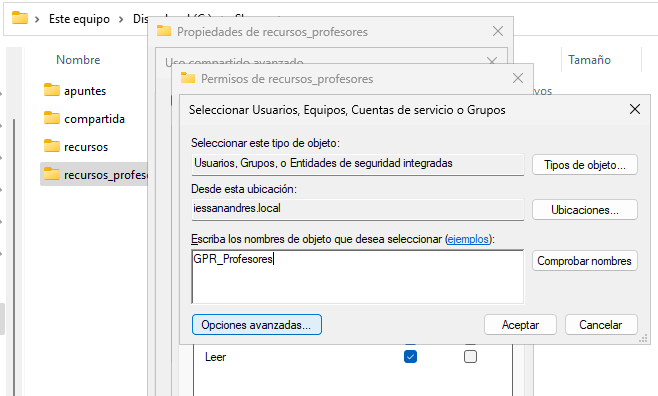

Ahora desde el administrador de directivas de grupo seleccionamos Preferencias > Configuración de Windows y buscamos "Asignaciones de unidades", hacemos click derecho en el espacio en blanco y seleccionamos Nueva unidad asignada, se abrirá una ventana en la que especificaremos que queremos usar la letra P. Cambiamos a la pestaña Comunes y ahi marcamos el checkbox "Destinatarios de nivel de elemento" y hacemos click en "Destinatarios...".

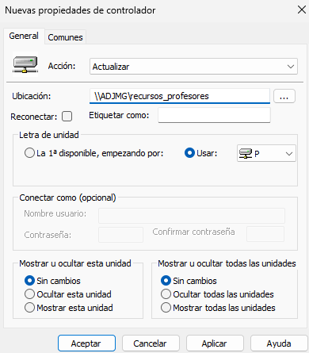

Se nos abrirá una nueva ventana donde selecionaremos Nuevo elemento > Grupos de seguridad, indicamos el grupo y aplicamos.

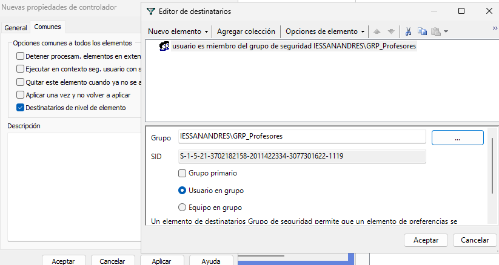

### 2.2. Accesos Directos (Shortcuts)

Volvemos a hacer click derecho sobre la GPO > Editar > Preferencias > Configuración de windows > Accesos directos, hacemos click derecho sobre el espacio en blanco > Nuevo > Acceso directo.

Se nos abrirá una venta en la que introducimos los datos que se nos pide, en direccion de URL ponemos `http://intranet.iessanandres.local`.

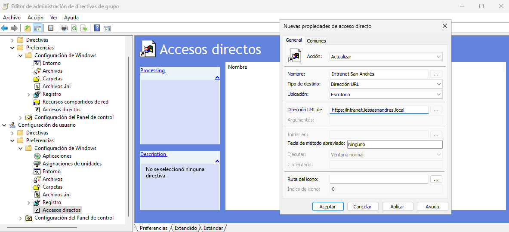

Para asignarlo al grupo correspondiente seguimos los pasos del apartado anterior y en Propiedades > pestaña Comunes marcamos el checkbox de Destinatarios y hacemos click en Destinatarios, desde la nueva ventana seleccionamos el grupo correspondiente.

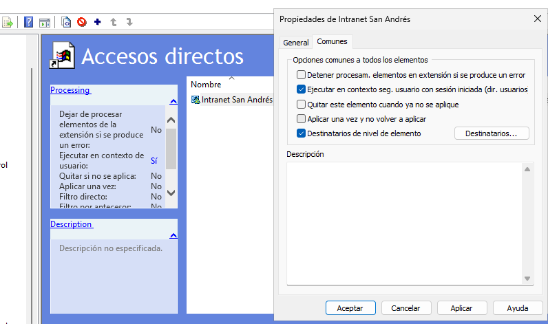

## Parte 3: Filtrado WMI Avanzado

### 3.1. Gestión de Memoria Virtual

Creamos la GPO GPO_HighPerf_Security y la vinculamos a la raiz de nuestro dominio.

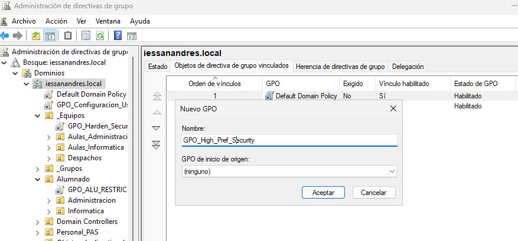

Desde Directivas locales > Opciones de seguridad, habilitamos la directiva "Apagado: borrar el archivo de paginacion de memoria virtual.

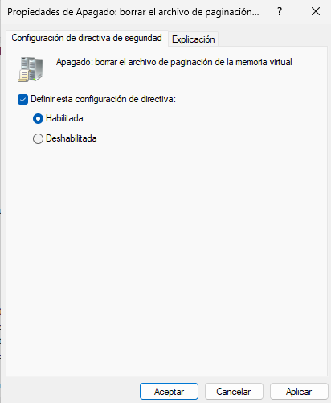

Ahora hacemos click derecho en Filtros WMI > Nuevo...

Se nos abrirá una ventana en la que pondremos nombre y descripción y hacemos click en agregar que nos abrirá otra ventana en la que escribimos `SELECT * FROM Win32_ComputerSystem WHERE TotalPhysicalMemory >= 4294967296`. Aceptamos y guardamos.

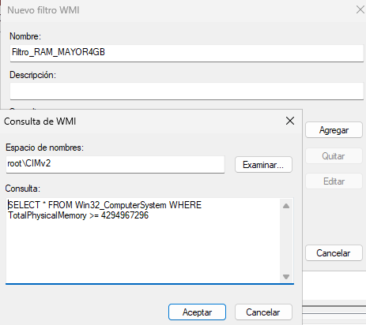

Si ahora seleccionamos nuestra GPO, abajo del todo, en la sección Filtrado WMI podemos seleccionar el filtro que acabamos de crear.

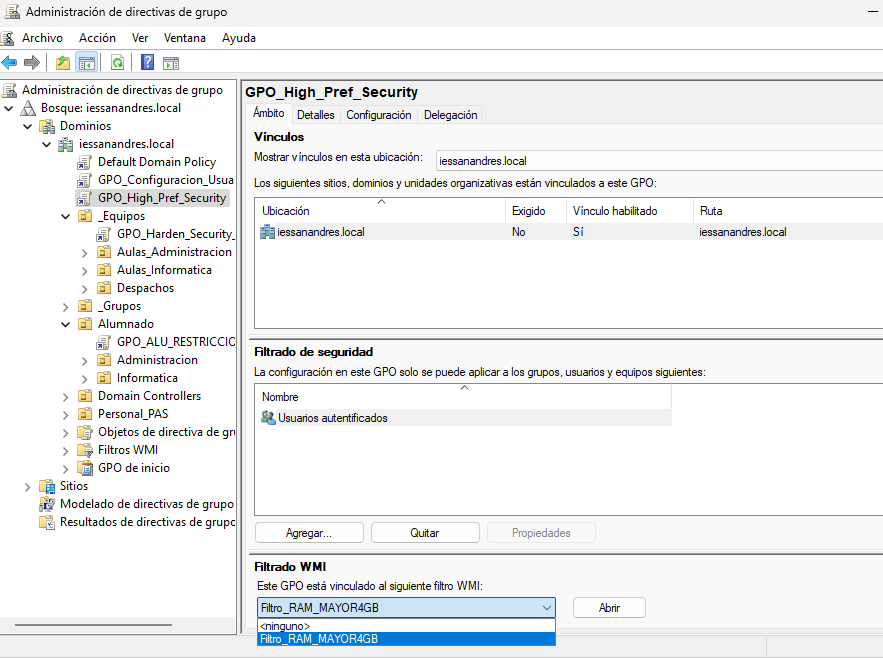

### 3.2. Diferenciación de Sistema Operativo (Workstation vs Server)

Creamos una nueva GPO llamada GPO_Clientes_UAC y la vinculamos a la raiz de nuestro dominio.

Le hacemos click derecho > Editar y volvemos a Directivas locales > Opciones de seguridad y deshabilitamos la directiva "Control de cuentas de usuario: detectar instalaciones de aplicaciones y pedir confirmación de elecación".

Repetimos los pasos anteriores para crear un filtro en Filtros WMI solo que el codigo que tenemos que introducir ahora es este:

`SELECT * FROM Win32_OperatingSystem WHERE ProductType = 1`

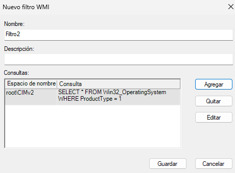

Y lo asignamos a la GPO como hicimos en el ejercicio anterior.

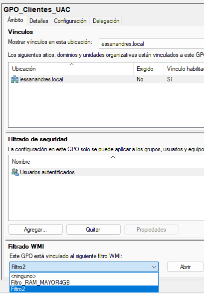
