# PR0701: Compartición de carpetas con Samba

## Preparación del entorno

Vamos a utilizar 3 máquinas virtuales

- Ubuntu server 20.04 como servidor de Samba
- Ubuntu Desktop 20.04 como cliente de Samba
- Windows 10 como cliente de Samba

## Intalación y configuración de las máquinas

Instalamos las máquinas de manera normal, una vez instaladas les configuramos una ip estatica.

- En el caso de ubuntu server editamos el fichero `/etc/netplan/00-installer-config.yaml` y lo aplicamos con `sudo netplan apply`

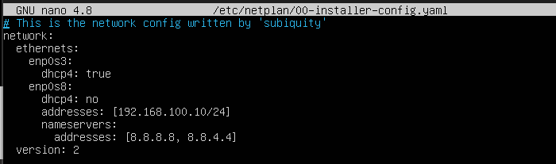

- En ubuntu desktop lo hacemos desde la interfaz gráfica

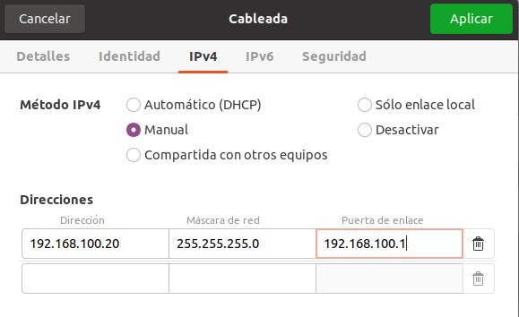

- En windows 10 al igual que en ubuntu desktop lo hacemos desde la interfaz gráfica.

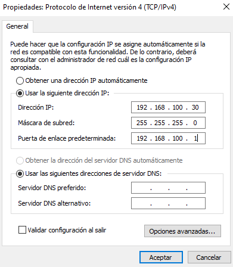

## Instalación de Samba

Para instalar Samba en ubuntu server utilizamos `sudo apt install samba smbclient`

## Creacion de usuarios y grupos

Creamos los grupos gerencia, administracion y taller

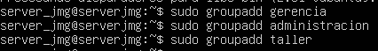

Creamos los usuarios y los asignamos a cada grupo

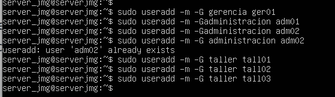

Ahora asignamos contraseñas en Samba a cada usuario

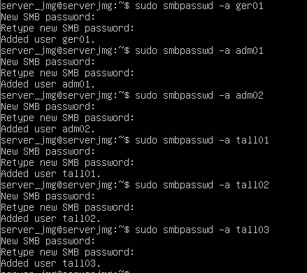

## Creacion de carpetas compartidas

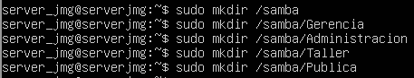

### Cambiamos propietarios y permisos

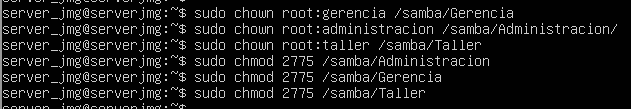

## Configuracion de smb.conf

Copiamos lo siguiente en /etc/samba/smb.conf

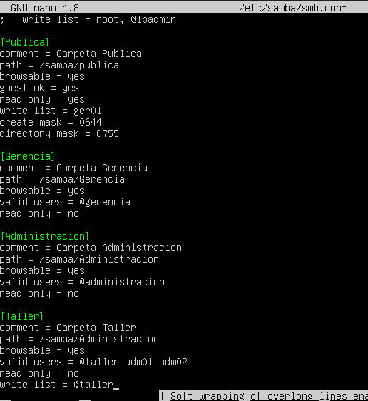

Dentro de la sección [global] vamos a añadir esta linea:
`map to guest = bad user`

Guardamos y reiniciamos el servicio de samba con `systemctl restart smbd`

Ya estaría nuestro servidor de Samba funcionando.

## Acceso desde ubuntu desktop

### Taller

Para acceder desde ubuntu primero debemos crear los usuarios de taller con useradd e instalamos lo siguiente
```
sudo apt install smbclient
sudo apt install cifs-utils
```

Montamos la carpeta compartida con `sudo mkdir -p /mnt/Taller` y `sudo mount -t cifs //192.168.100.10/Taller /mnt/Taller -o user=tall01,pass=jose,uid=tall01,noperm` 

### Publica

Creamos y montamos al igual que en el paso anterios ahora la carpeta Publica.

```
mkdir /mnt/Publica
sudo mount -t cifs //192.168.100.10/Publica /mnt/Publica -o guest,uid=tall01,noperm
```

Con las 2 carpetas creadas ya estaría todo montado en ubuntu desktop.

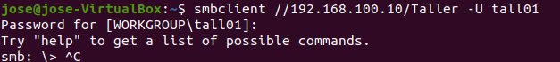

## Acceso desde windows 10

Desde windows 10 vamos a Configuracion > Cuentas > Familia y Otros usuarios y creamos los usuarios de administracion y de gerencia.

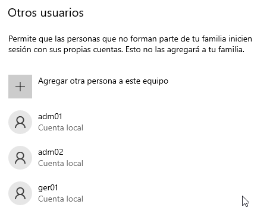

Desde el explorador de archivos ponemos `\\192.168.100.10`

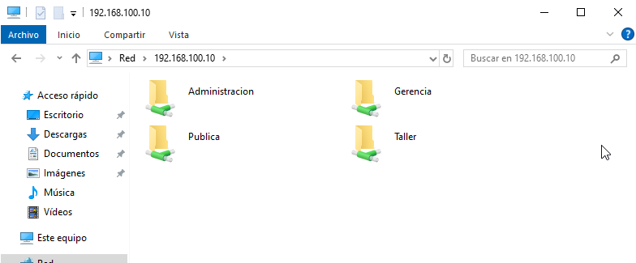

Probamos a acceder y nos pedira usuario y contraseña.

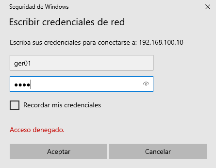

Probamos a crear un documento para comprobar que tenemos permisos.

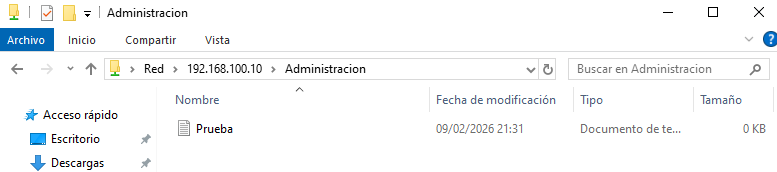

Y con eso ya estaría conectado windows10 a nuestro servidor Samba.